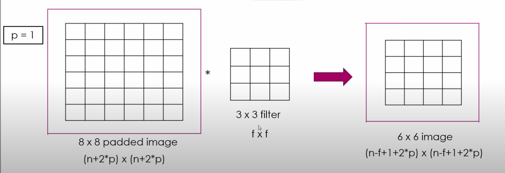
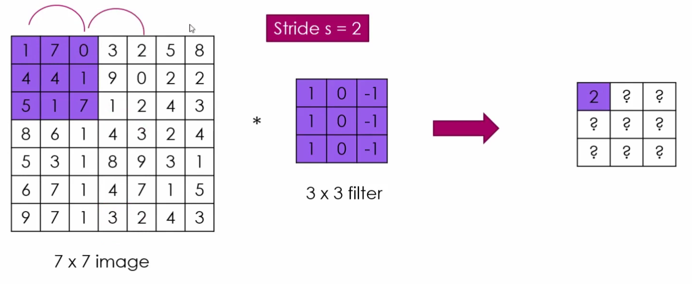
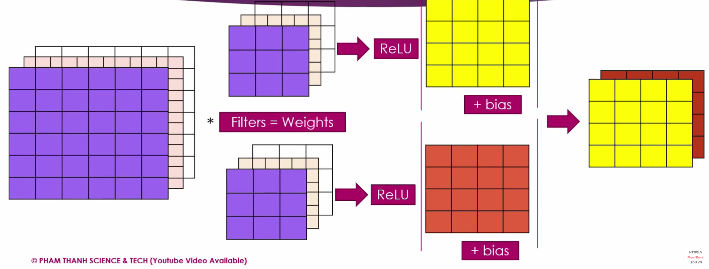

# Mạng Neural Tích chập (Convolutional Neural Networks)

- [Mạng Neural Tích chập (Convolutional Neural Networks)](#mạng-neural-tích-chập-convolutional-neural-networks)
  - [1. Giới thiệu về các bài toán của thị giác máy tính](#1-giới-thiệu-về-các-bài-toán-của-thị-giác-máy-tính)
    - [Bài toán phân loại các bức ảnh](#bài-toán-phân-loại-các-bức-ảnh)
    - [Bài toán phức tạp hơn là bài toán phát hiện vật thể (Object Detection).](#bài-toán-phức-tạp-hơn-là-bài-toán-phát-hiện-vật-thể-object-detection)
    - [Chuyển đổi phong cách của bức tranh](#chuyển-đổi-phong-cách-của-bức-tranh)
  - [2. Kỹ thuật Edge Detection: Tìm ra các cạnh trong ảnh](#2-kỹ-thuật-edge-detection-tìm-ra-các-cạnh-trong-ảnh)
  - [3. Phép toán tích chập (Convolutional Operation)](#3-phép-toán-tích-chập-convolutional-operation)
    - [Cách tính](#cách-tính)
    - [Các hàm trong lập trình](#các-hàm-trong-lập-trình)
    - [Đi sâu hơn về bài toán phát hiện cạnh](#đi-sâu-hơn-về-bài-toán-phát-hiện-cạnh)
    - [Học để phát hiện cạnh](#học-để-phát-hiện-cạnh)
  - [4. Padding và Stride](#4-padding-và-stride)
    - [Padding](#padding)
    - [SAME và VALID CONVOLUTIONS](#same-và-valid-convolutions)
    - [Strided Convolution](#strided-convolution)
    - [So sánh với mạng Neural thông thường](#so-sánh-với-mạng-neural-thông-thường)
  - [5. Tích chập trên các bức ảnh màu RGB](#5-tích-chập-trên-các-bức-ảnh-màu-rgb)
    - [Hoàn thiện bức tranh về CNN](#hoàn-thiện-bức-tranh-về-cnn)
  - [6. Ví dụ về mạng neural tích chập](#6-ví-dụ-về-mạng-neural-tích-chập)
  - [7. Pooling Layers](#7-pooling-layers)
    - [Các loại layer trong CNN](#các-loại-layer-trong-cnn)
    - [Max Pooling](#max-pooling)
    - [Average Pooling](#average-pooling)
    - [Tổng kết lại](#tổng-kết-lại)
  - [8. Mạng CNN tiêu biểu: LE-NET5](#8-mạng-cnn-tiêu-biểu-le-net5)
  - [9. Tại sao lại dùng phép toán tích chập](#9-tại-sao-lại-dùng-phép-toán-tích-chập)
  - [10. Tổng kết lại](#10-tổng-kết-lại)

## 1. Giới thiệu về các bài toán của thị giác máy tính

### Bài toán phân loại các bức ảnh

Ví dụ cho các bức ảnh, phân loại xem ảnh đó có **mèo** không? Nếu có xuất hiện con mèo thì output là 1 và ngược lại thì 0.

### Bài toán phức tạp hơn là bài toán phát hiện vật thể (Object Detection). 

Cần phát hiện ra ô tô và khoanh vùng được đối tượng. Nằm trong lĩnh vực xe tự lái, cần phát hiện vật thể thông qua camera hành trình của ô tô. Cần phải phát hiện thêm: *tọa độ, hướng di chuyển, vật thể là gì (ô tô, xe máy, người đi bộ, ...)* từ đó xe tự lái mới đưa ra được quyết định đúng đắng

### Chuyển đổi phong cách của bức tranh

Liệu có thể có 1 bức tranh nàng Monalisa theo phong cách của bức tranh bên phải được không? Vấn đề bài toán được giải quyết sẽ đưa ra kết quả sau

Đây là một trong các bài toán tiêu biểu và thú vị trong thị giác máy tính.

## 2. Kỹ thuật Edge Detection: Tìm ra các cạnh trong ảnh

Đây là bài toán cơ bản và đơn giản nhất của thị giác máy tính.

Xét bài toán nhận diện khuôn mặt, để nhận diện được khuôn mặt trước tiên phải nhận diện được các chi tiết góc cạnh của khuôn mặt: mắt, mũi, miệng, ... Và trước tiên phải nhận diện được các đường nét. 

Các đường ở đây có thể là đường thẳng theo phương ngang, theo chiều dọc, chéo, ... Nếu là đường cong thì là tập hợp của rất nhiều đoạn thẳng nhỏ liên tiếp nhau. Suy ra các bài toán nhận diện thì trước tiên phải phát hiện ra các cạnh.

## 3. Phép toán tích chập (Convolutional Operation)

### Cách tính

Xét một bức ảnh xám đơn giản 6x6 và `filter` hay `kernel` 3x3 (trong thị giác máy tính 2 thuật ngữ này có thể thay thế cho nhau)

Hai toán tử của phép toán là 2 ma trận bức ảnh 6x6 và bộ lọc 3x3, xong kết quả là một ma trận khác 4x4. Vì sao lại là 4x4 thì ta sẽ đi trả lời ngay sau đây.

Đầu tiên lấy một ma trận có cùng kích thước với filter, và nhân tương ứng từng phần tử của hai ma trận với nhau, cuối cùng ta có 9 phép nhân, lấy kết quả cộng lại toàn bộ với nhau thì `=2`. Vậy 2 là kết quả của phép toán tích chập đầu tiên.

Tiếp theo ta dịch chuyển ma trận cùng cỡ với filter trên ảnh sang 1 ô bên phải, và thực hiện tương tự phép tích chập như ở trên. Khi không thể sang phải được nữa, ta quay lại nơi bắt đầu và dịch chuyển đi xuống 1 ô và tiếp tục sang phải.

Cứ tiếp tục dịch chuyển, sẽ ra thành ma trận kết quả 4x4. 

**Lưu ý**: Trong bức ảnh là một ma trận được khởi tạo ngẫu nhiên và không mang ý nghĩa gì, nhưng trong filter lại là có sự tương đồng khi các cột lần lượt là 1, 0, -1. Nó có ý nghĩa riêng của nó.

Về kích thước của ma trận kết quả, ta có thể để ý được rằng chiều dài sẽ là 6 - 3 + 1, tương tự rộng cũng là 6 - 3 + 1. Vậy nếu ma trận bức ảnh là $(m, n)$ và ma trận filter là $(i, j)$ thì ma trận kết quả có kích thước $(m - i + 1, n - j + 1)$. 

### Các hàm trong lập trình

- `Python`: conv_forward
- `Tensorflow`: tf.nn.conv2d
- `Keras`: Conv2D

Ta sử dụng phép tích chập để nhận diện cạnh ranh giới giữa màu trắng và màu đỏ, ở đây trắng là số dương, 0 là đỏ, và đen là số âm. Mục đích của bài toán phát hiện cạnh, là làm nổi bật cạnh đó lên như hình minh họa.

Filter 1, 0, -1 sử dụng để phát hiện cạnh đứng, như là một con mắt cho máy tính, đó là ý nghĩa. Với các filter khác nhau thì ta có thể phát hiện nhiều cạnh khác nhau.

### Đi sâu hơn về bài toán phát hiện cạnh

Filter bên phải là filter để phát hiện cạnh theo phương nằm ngang.

Dù ảnh chúng ta có cả cạnh đứng lẫn cạnh ngang, nhưng filter chỉ chuyên dùng cho phát hiện cạnh ngang thì không thể phát hiện ra cạnh đứng. Ngược lại dùng filter chuyên quét cho phương thẳng đứng thì cũng phát hiện ra cạnh đứng được tô đậm, nhưng không thể phát hiện ra cạnh ngang. 

### Học để phát hiện cạnh

Trong thực tế, các cạnh theo phương đứng không bao giờ thẳng đứng 100%, có thể nghiêng 10 độ, 20 độ, ... nên không thể thiết kế từng cái filter để giải quyết vấn đề nhận diện cạnh ở các góc độ khác nhau. Mà ta cần phải làm chương trình học được các giá trị phù hợp để phát hiện ra các cạnh phù hợp từ đó gọi là *learning for edge detection*.

Ta tổng quát hóa bài toán nhận diện cạnh bằng cách để filter là ma trận trọng số. Các trọng số $w_1$ đến $w_9$ được gọi là *learnable parameters*. Với mỗi bài toán về Computer Vision trong mạng tích chập sẽ có rất rất nhiều filter 3x3, hàng trăm nghìn, ... Đó là nguyên tắc cơ bản của thị giác máy tính và mạng Neural Tích chập.

## 4. Padding và Stride

### Padding

Trong ảnh ta có thể thấy được rằng các pixel ở 4 góc rìa chỉ đóng góp vào phép toán tích chập đúng 1 lần trong khi có pixel ở hàng 3 cột 3 đã đóng góp 9 lần và phép toán tích chập. Điều này dẫn đến hình ảnh sau khi thực hiện phép toán có thể bị thiếu mất đi thông tin, đặc biệt nếu trường hợp các thông tin quan trọng nằm ở các cạnh rìa của ảnh thì đây là một mất mác lớn. Thứ hai là sự giảm chiều của bức ảnh từ 6x6 thành 4x4. Để giải quyết chuyện này ta có phương pháp **Padding**.

Trước khi thực hiện phép toán tích chập, ta sẽ bồi thêm vào bức ảnh mỗi phía thêm 1 pixel từ đó bức ảnh từ 6x6 thành 8x8. Ta có thể cho các giá trị bồi thêm bằng 0. 

Từ đó bức ảnh sẽ giữ lại được kích thước gốc là 6x6 và các pixel ở góc đã được đóng góp nhiều hơn và phép toán. Tuy nhiên không thể lạm dụng **Padding** nó có thể gây nhiễu, vì các con số ta đưa vào padding không tuân theo quy tắc gì cả và làm không đúng thông tin của bức ảnh gốc, vậy đây vẫn là con dao hai lưỡi. Giá trị $p$ có thể là bất cứ giá trị nào, tùy sự lựa chọn.

### SAME và VALID CONVOLUTIONS

Valid nghĩa là không có padding, Same nghĩa là thêm padding nghĩa là ảnh đầu vào có size bằng ảnh đầu ra. Và muốn có Same Convolutions ta phải có công thức sau

$$
\begin{align*}
    n - f + 1 + 2p = n\\
\Leftrightarrow 2p = f - 1
\end{align*}
$$

**Lưu ý**: $f$ thường là số lẻ. Thường là 3, 5, ..., cũng có thể dùng 1 nhưng mà ít khi gặp. Nếu $f$ là số chẵn thì ta có thể padding không đều, ví dụ bên trái 1 pixel và bên phải 2 pixel.

### Strided Convolution

Ví dụ với bước nhảy $s = 2$. 

Tích chập theo bước nhảy $s$. Vậy các trường hợp đã kể trước đó là strided với bước nhảy bằng 1. 

Từ đó ta có kích cỡ của ma trận đầu ra là $\displaystyle \left( \frac{n-f}{s} + 1 \right) \times \left(  \frac{n - f}{s} + 1 \right)$

Bước nhảy càng lớn khiến ta rà soát bức ảnh càng nhanh, nhưng cũng khiến ta mất càng nhiều thông tin của bức ảnh. 

Nếu ta kết hợp cả Padding và Stride thì ta có kích cỡ ma trận đầu ra là $\displaystyle \left( \frac{n-f+2p}{s} + 1 \right) \times \left(  \frac{n - f+2p}{s} + 1 \right)$

**Lưu ý**: Nếu $(n-f+2p)$ không chia hết cho $s$ thì ta cần làm tròn xuống. 

### So sánh với mạng Neural thông thường

## 5. Tích chập trên các bức ảnh màu RGB

Trong thực tế, các ảnh ta xử lý đều là ảnh màu, nên việc ảnh sẽ không còn là ma trận 2 chiều là điều dễ hiểu. Từ đó là có ma trận nhiều, và bắt buộc chiều sâu của bức ảnh và chiều sâu của filter phải bằng nhau. Ví dụ một bức ảnh RGB có chiều sâu là 3 thì filter cũng phải có chiều sau là 3.

Vậy output sẽ có kích cỡ như thế nào? Câu trả lời là output vẫn là ma trận 2 chiều. Dù cho chiều sâu ảnh có là bao nhiêu đi nữa.

Tuy nhiên như vậy thì bức ảnh đầu ra sẽ chỉ có 1 chiều, trong khi ảnh đầu vào là 3 chiều. Để bức ảnh đầu ra có nhiều chiều ta sẽ sử dụng thêm filter, sau đó ghép các bức ảnh lại ta đã có bức ảnh đầu ra nhiều chiều.

Vì sao ta cần nhiều filter? Là vì bức ảnh phức tạp mỗi nơi lại có các đường nét khác nhau, góc cạnh khác nhau nên ta cần bóc tách ra các cạnh khác nhau. Ta càng bóc tách nhiều khía cạnh khác nhau thì càng bóc tách ra được nhiều thông tin. Vì vậy trong mạng Neural tích chập mỗi bước tích chập có thể có hàng chục, hàng trăm filters.

### Hoàn thiện bức tranh về CNN

Hình ảnh một Layer trong CNN

Số lượng tham số trong mạng Neural Tích Chập. Xét một lớp của CNN, input là bức ảnh 6x6x3 với 10 filters 3x3x3 thì output sẽ là bức ảnh 4x4x10. Vậy số lượng tham số là bao nhiêu?

Ở mỗi filter ta có $3 \times 3 \times 3 + 1 = 27$ tham số vậy tổng cộng có 280 tham số với 10 filters và nó không phụ thuộc vào kích cỡ ảnh đầu vào chỉ phụ thuộc vào kích thước và số lượng filter, đây chỉnh là điểm quan trọng của CNN so với ANN là số lượng tham số phụ thuộc vào đầu vào. 

## 6. Ví dụ về mạng neural tích chập

Bài toán nhận diện một con số được viết bằng tay, kích thước ảnh là 27x27x3 thông qua các lớp trong CNN

Ta có thể thấy mạng CNN này có 3 lớp Tích Chập và càng ngày số lượng filters càng tăng và kích thước của ảnh thì càng giảm. Nghĩa là càng ngày càng giảm kích thước ảnh xuống nhưng càng học được nhiều hơn, bóc tách được nhiều chi tiết hơn.

## 7. Pooling Layers

### Các loại layer trong CNN

- Convolution (CONV)
- Pooling (POOL)
- Fully Connected (FC)

### Max Pooling

Với mỗi kích thước ma trận con 2x2 ta lấy giá trị lớn nhất. Đơn giản hơn rất nhiều so với Tích Chập vì không có trọng số gì cả chỉ cần lấy giá trị lớn nhất mà thôi. Thêm ví dụ với filter là 3x3 và ảnh đầu vào là 5x5

Trong trường hợp ảnh đầu vào có thêm chiều sâu, thì ảnh đầu ra cũng sẽ có thêm chiều sâu. Thực hiện max pooling trên từng channel (từng chiều sâu một).

### Average Pooling

Tương tự với max pooling nó sẽ lấy giá trị trung bình với mỗi kích thước của filter trên ma trận ảnh đầu vào.

### Tổng kết lại

Trong thực tế, max pooling được sử dụng nhiều và thường xuyên hơn average pooling. Tuy nhiên đây vẫn là một chủ đề khá sâu.

Các siêu tham số trong Pooling: 

- f: filter size
- s: stride
- Max or Average Pooling

Thực tế thường sử dụng $f=2, s=2$ từ đó chiều dài và chiều rộng của ảnh sẽ giảm đi một nửa. Rất ít khi sử dụng padding trong Pooling, do khi dùng Pooling mục đích và để giảm kích cỡ ảnh xuống nên không dùng padding làm gì.

## 8. Mạng CNN tiêu biểu: LE-NET5

Bài toán nhận diện chữ số

Số tham số của mạng LE-NET5

## 9. Tại sao lại dùng phép toán tích chập

Trong thị giác máy tính, đầu vào chắc chắn là bức ảnh, nó có thể có độ phân giải cao lên đến hàng triệu pixel nên nếu sử dụng mạng Neural thông thường fully connected thì số lượng tham số rất lớn có thể lên đến hàng tỷ tham số. Do đó người ta mới áp dụng Convolution vào bài toán thị giác máy tính.

Nhưng tại sao, với số lượng tham số nhỏ như vậy CNN lại vẫn giải quyết được bài toán trên những ảnh có hàng nghìn hàng triệu pixel. Câu trả lời là do, các filter có thể dùng được cho cả bức ảnh nên chúng chia sẽ tham số với nhau. Ví dụ như filter chuyên nhận diện cạnh ngang có thể quét toàn bộ bức ảnh chỉ với 9 tham số. 

## 10. Tổng kết lại

Tất cả những nội dung trên chỉ là bước lan truyền tiến, thật ra ta cần thực hiện lan truyền ngược

Nhưng để lan truyền ngược trên CNN là rất phức tạp, thật may các framework là giúp chúng ta. :)))